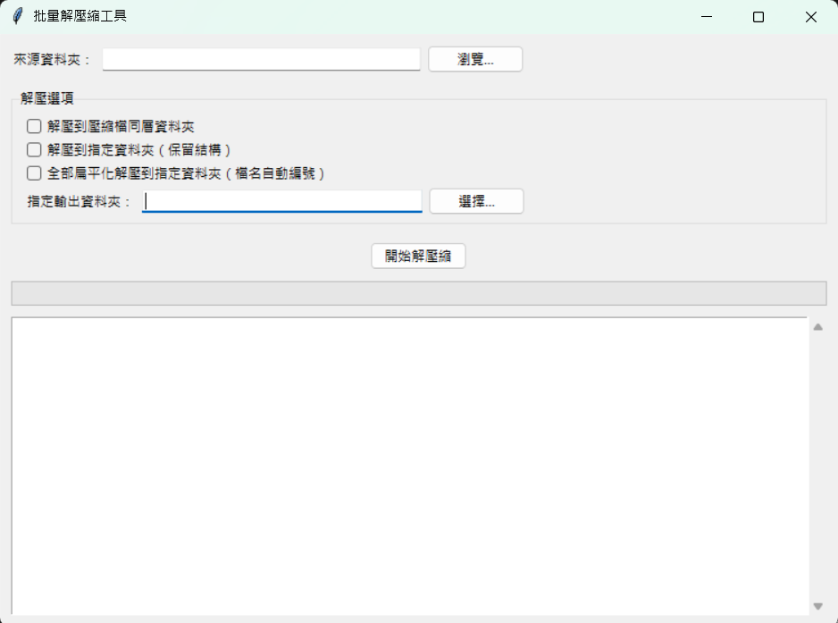

# 📦 批量解壓縮工具（Batch Unzipper GUI）

這是一個使用 Python tkinter 開發的圖形介面應用程式，支援批量解壓縮 `.zip`、`.7z`、`.rar` 壓縮檔，提供三種不同的解壓模式，操作簡單直覺。

---

## 🧩 功能特色

- ✅ 支援 `.zip`, `.7z`, `.rar` 壓縮格式
- ✅ 圖形介面簡單易用，無需命令列操作
- ✅ 三種解壓模式可選：
  1. 解壓到壓縮檔同層資料夾
  2. 解壓到指定資料夾（保留結構）
  3. 扁平化解壓（所有檔案集中，自動編號）
- ✅ 解壓過程即時顯示進度與日誌紀錄

---

## 🖼️ 操作畫面預覽

> 主畫面預覽如下：



---

## ⚙️ 安裝方式

1️⃣ 建議使用 Python 3.9 或以上版本。

2️⃣ 安裝相依套件：

```bash
pip install -r requirements.txt
3️⃣ 安裝 unrar（僅需在解壓 .rar 時安裝）：

Windows：下載 UnRAR for Windows，並加入系統環境變數

macOS：


brew install unrar
Ubuntu / Debian：


sudo apt install unrar
🚀 執行方式

python main.py
執行後會開啟圖形介面，請選擇來源資料夾與解壓方式，點擊「開始解壓縮」即可操作。

📁 專案結構

batch-unzipper/
├── main.py              # 主程式
├── requirements.txt     # 相依套件
├── README.md            # 專案說明文件
├── .gitignore           # 忽略不必要的檔案
└── assets/
    └── gui.png          # GUI 畫面截圖
📌 注意事項
.rar 格式需安裝外部 unrar 工具，否則會解壓失敗。

扁平化解壓會將所有檔案集中，並自動使用數字命名避免重複。

程式會自動跳過目錄與空資料夾。

📃 授權 License
本專案採用 MIT License 授權。歡迎自由使用與修改，請註明原作者。

🔜 待辦清單（TODO）
 多語系支援（英文 UI）

 支援密碼保護壓縮檔

 拖曳壓縮檔至視窗直接解壓

 壓縮完成報告匯出（log 檔）

